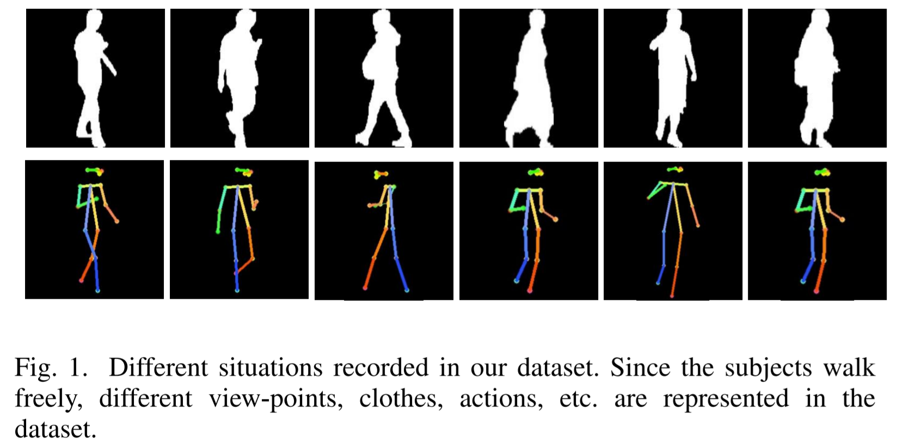

# ReSGait: The real scene gait dataset | Code of Banchmark experiments
[Paper](https://ieeexplore.ieee.org/abstract/document/9484347/)| [ReSGait Dataset](https://faculty.sustech.edu.cn/?cat=3&tagid=yusq&orderby=date&iscss=1&snapid=1&lang=en)

## Citation
If the code or ReSGait dataset help your research, please cite :)
```tex
@inproceedings{resgait,
 title={{ReSGait}: The Real-Scene Gait Dataset},
 author={Zihao Mu and Francisco M. Castro and Manuel J. Mar\'in-Jim\'enez and Nicol\'as Guil and Yan-ran Li and Shiqi Yu},
 booktitle={International Joint Conference on Biometrics (IJCB 2021)},
 year={2021}
}
```

# Overview

This repo is made for benchmark experiments of our paper `ReSGait: The real scene gait dataset`. This repo refers to [[1]](https://github.com/pudae/kaggle-hpa) and [[2]](https://github.com/AbnerHqC/GaitSet)

## Dataset Download
Dataset can be found at [THIS LINK](https://faculty.sustech.edu.cn/?cat=3&tagid=yusq&orderby=date&iscss=1&snapid=1&lang=en)

## Differences in label.csv
After downloading the dataset, mv the `label.csv` to this project `./data` folder.
And modify the label on the first line to make it easier to use.
```
from: 
VideoID,cloth,phoneUse,gender,carry,walkingRoute,SubjectID,ShootingDate

TO: 
ID,cloth,activity,gender,carry,path,id,date
```
And there is a given example at "./data/label_example.csv".

## How to run?

First step: download and prepare the data set and labels as described pre.

Second step: change `./configs/config_example.yml` and set your own training parameter.

Third step: set `train.sh` to your own `config.yml`

Final step: set your own testing parameter and run the `test.sh`.

## Update
Benchmark experiments based on GaitSet will be open source as soon as possible.
It will be available at https://github.com/zihaomu/GaitSet (Not finished.).

## Reference of Code
[1] https://github.com/pudae/kaggle-hpa (BSD License.)

[2] https://github.com/AbnerHqC/GaitSet (non-commercial License.)